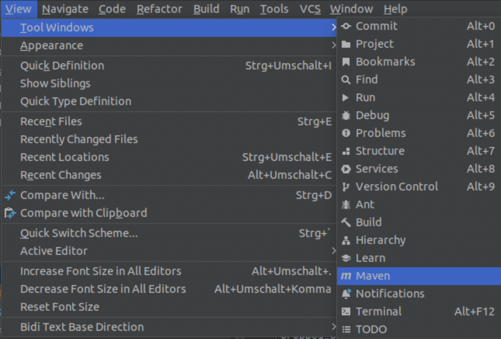
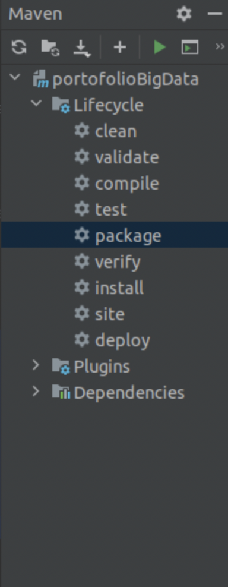
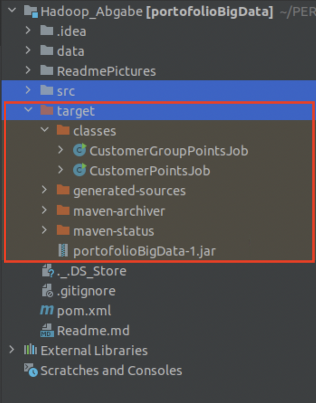
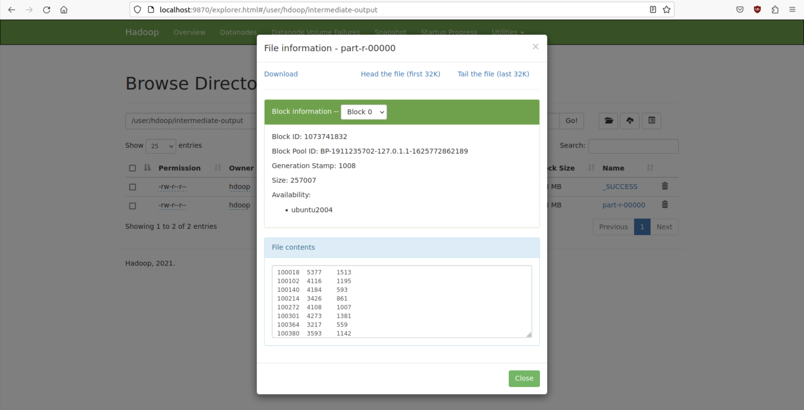

# Hinweis

Dies ist nur die \texttt{README.md} für eigene Zwecke. Die für die Abgabe bestimmte PDF-Datei liegt im Verzeichnis.

# Hadoop MapReduce Job Anleitung für das Modul Big Data Storage


Diese Anleitung ist Teil der Abgabe für das Modul Big Data Storage. Ziel ist es, eine Analyse der Datei `fluege.csv` durchzuführen, die wie folgt spezifiziert ist:

## Aufgabenstellung

1. Bilden Sie für jeden Kunden die Summe der erworbenen und eingelösten Punkte.
2. Segmentieren Sie die Kunden in drei Gruppen basierend auf den erworbenen Punkten:
   - Gruppe 1: Kunden mit höchstens 2000 erworbenen Punkten.
   - Gruppe 2: Kunden mit 2001 bis 10000 erworbenen Punkten.
   - Gruppe 3: Kunden mit mindestens 10001 erworbenen Punkten.
3. Für jede Gruppe, geben Sie die folgenden Informationen aus:
   - Anzahl der Kunden in der Gruppe.
   - Summe der von der Gruppe erworbenen Punkte.
   - Anteil der eingelösten Punkte an den insgesamt erworbenen Punkten, angegeben in Prozent.
4. Die Verarbeitung soll ohne Nachkommastellen erfolgen, d.h., die numerischen Werte sind gerundet einzulesen und auszugeben.
5. Implementieren Sie zwei MapReduce-Programme, um die obigen Schritte zu realisieren. Beide Programme sollten jeweils einen Combiner-Schritt beinhalten.
6. Definieren Sie drei Verzeichnisse im HDFS für den Prozess:
   - Eines für die Eingabedaten (`input`).
   - Eines für die Zwischenergebnisse (`intermediate-output`).
   - Eines für die Endresultate (`final-output`).

Im Folgenden finden Sie die spezifischen Befehle und Schritte zur Ausführung dieser Aufgaben mithilfe von MapReduce-Jobs in Hadoop.

## Vorbereitung

Bevor Sie die Jobs ausführen, stellen Sie sicher, dass Hadoop auf Ihrem System installiert und konfiguriert ist.

1. **Wechseln zum Hadoop-Benutzer**

   ```shell
   su - hdoop
   ```

   Geben Sie bei Aufforderung das Passwort `student` für den Benutzer `hdoop` ein.

2. **Starten Sie Hadoop**

   Führen Sie das Hadoop-Startskript aus, um alle notwendigen Dienste zu starten:

   ```shell
   ./start-hadoop.sh
   ```

## Job 1: Kundenpunkte Berechnung

### Schritt 1: Erstellen eines Eingabeverzeichnisses im HDFS

Erstellen Sie ein Eingabeverzeichnis im HDFS, falls es noch nicht existiert:

```shell
hdfs dfs -mkdir -p input
```

### Schritt 2: Hochladen der Eingabedatei ins HDFS

Laden Sie die CSV-Datei mit den Flugdaten in das zuvor erstellte Eingabeverzeichnis hoch:

```shell
hdfs dfs -put /home/student/PERSISTENT/Bigdata_abgabe/Hadoop_Abgabe/data/fluege.csv input
```

### Schritt 3: Kompilieren und Packen der Java-Datei mit Maven

Vor der Ausführung des MapReduce-Jobs müssen Sie Ihre Java-Datei kompilieren und in eine ausführbare JAR-Datei packen. Verwenden Sie Maven in IntelliJ IDEA, um dies zu tun:

**Öffnen Sie `View` > `Tool Windows` > `Maven`.**



**Führen Sie im Maven-Projekte-Fenster die Lifecycle-Phasen `compile` und `package` aus**



**Überprüfen Sie nach Abschluss, ob die JAR-Datei im `target`-Verzeichnis Ihres Projekts erstellt wurde**



### Schritt 4: Ausführen des ersten MapReduce-Jobs

Führen Sie den ersten MapReduce-Job aus, der die Summe der erworbenen und eingelösten Punkte pro Kunde berechnet:

```shell
hadoop jar <pfad-zur-jar-datei> CustomerPointsJob input intermediate-output
```

Ersetzen Sie `<pfad-zur-jar-datei>` mit dem Pfad zu Ihrer JAR-Datei, z.B.:

```shell
hadoop jar /home/student/PERSISTENT/Bigdata_abgabe/Hadoop_Abgabe/target/portofolioBigData-1.jar CustomerPointsJob /user/hdoop/input /user/hdoop/intermediate-output
```

## Job 2: Gruppierung der Kundenpunkte

### Schritt 5: Kompilieren und Packen der Java-Datei für Job 2 mit Maven

Wiederholen Sie Schritt 3 für den zweiten MapReduce-Job.

### Schritt 6: Ausführen des zweiten MapReduce-Jobs

Führen Sie den zweiten Job aus, der auf den Ergebnissen des ersten Jobs aufbaut und die Kunden in Gruppen einteilt:

```shell
hadoop jar <pfad-zur-jar-datei> CustomerGroupPointsJob /user/hdoop/intermediate-output /user/hdoop/final-output
```

Ersetzen Sie `<pfad-zur-jar-datei>` wie in Schritt 4 beschrieben.

## Ergebnisse

Nach der Ausführung befinden sich die Ergebnisse des ersten Jobs im Verzeichnis `/user/hdoop/intermediate-output` und die des zweiten Jobs im Verzeichnis `/user/hdoop/final-output`.

### Ergebnisse überprüfen

- **Für den ersten Job:**

Um die Ergebnisse des ersten Jobs zu überprüfen, können Sie den Inhalt des Ausgabeverzeichnisses listen und anzeigen:

```shell
hdfs dfs -ls /user/hdoop/intermediate-output
hdfs dfs -cat /user/hdoop/intermediate-output/part-r-00000
```

- **Für den zweiten Job:**

Wiederholen Sie den obigen Befehl für das finale Ausgabeverzeichnis des zweiten Jobs:

```shell
hdfs dfs -ls /user/hdoop/final-output
hdfs dfs -cat /user/hdoop/final-output/part-r-00000
```

**Alternative Überprüfung im HDFS Web Interface:**

Sie können auch das HDFS-Webinterface nutzen, um die Dateisystemstruktur und die Ergebnisse zu überprüfen. Navigieren Sie zu:

[http://localhost:9870/dfshealth.html#tab-overview](http://localhost:9870/dfshealth.html#tab-overview)

Um die Dateien zu durchsuchen, gehen Sie zu:

1. Klicken Sie oben auf den Reiter `Utilities`.
2. Wählen Sie `Browse the File System`.
3. Navigieren Sie zum gewünschten Verzeichnis, z.B. `/user/hdoop/intermediate-output` für den ersten Job



oder `/user/hdoop/final-output` für den zweiten Job.


